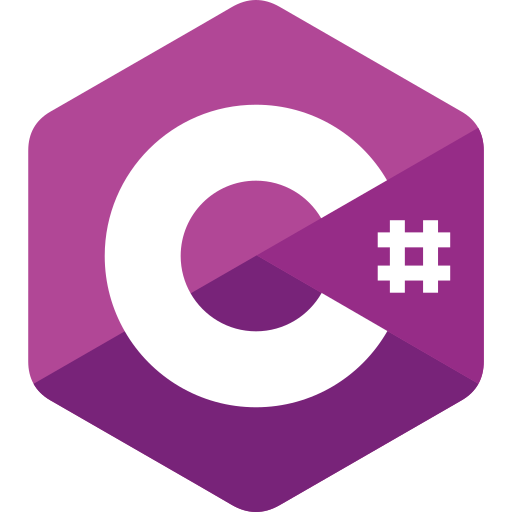
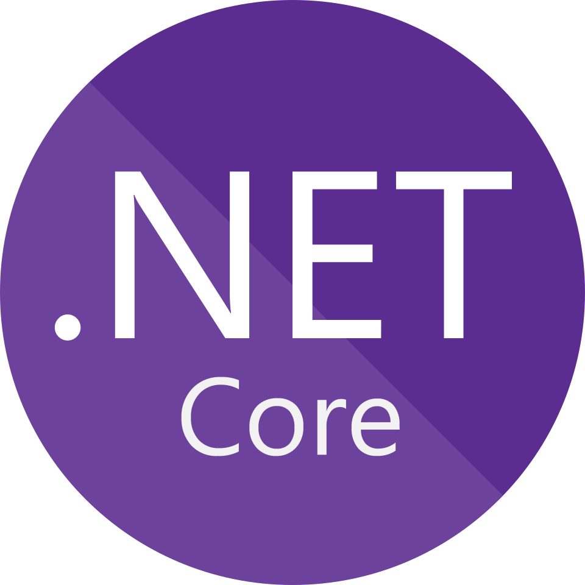
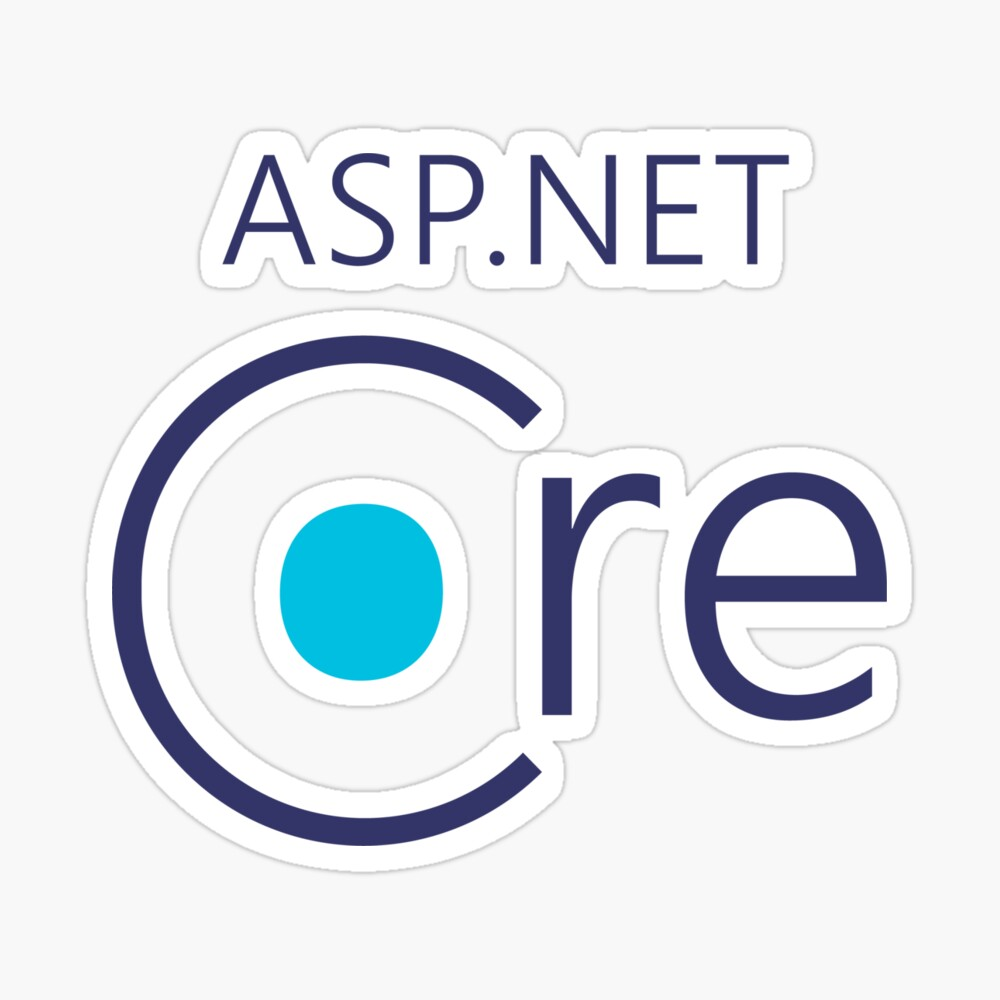
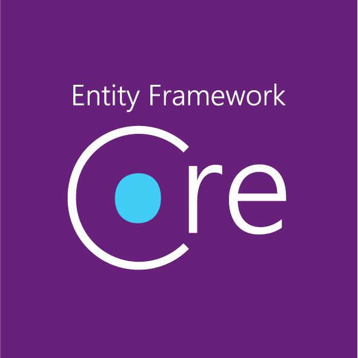
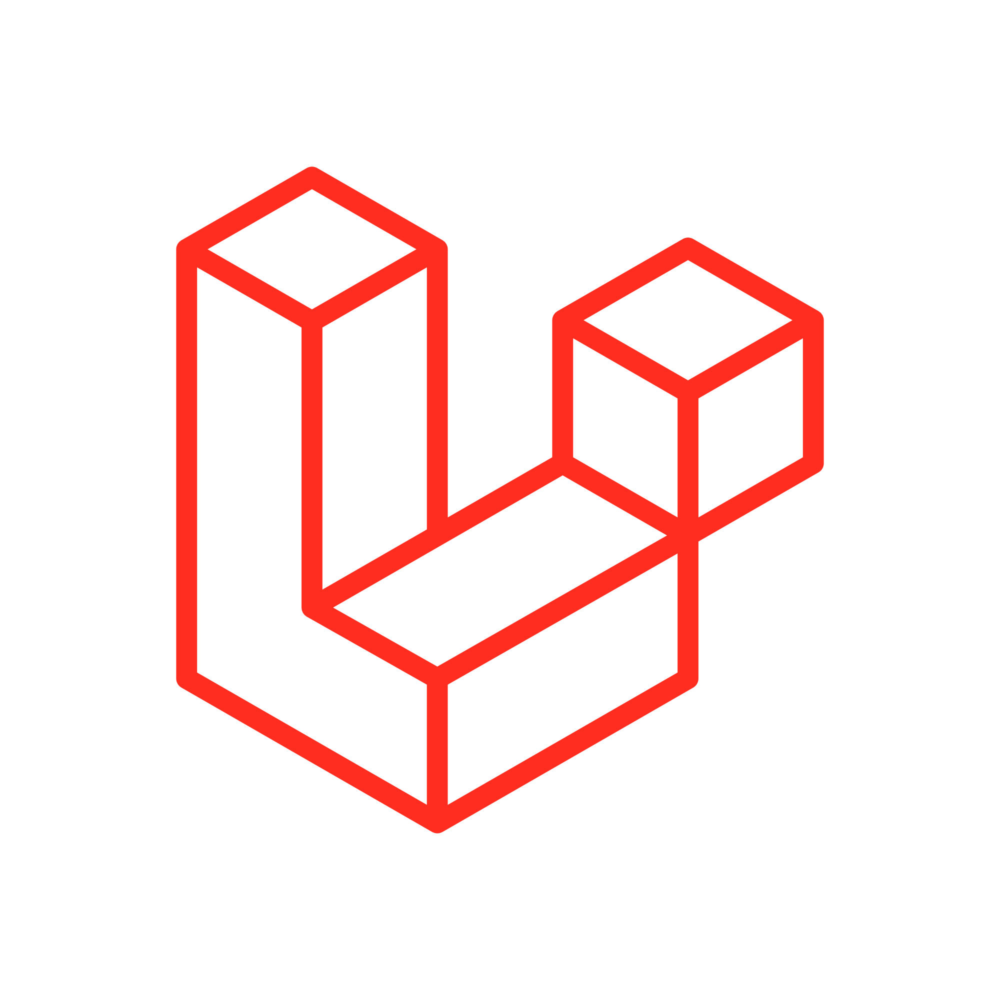
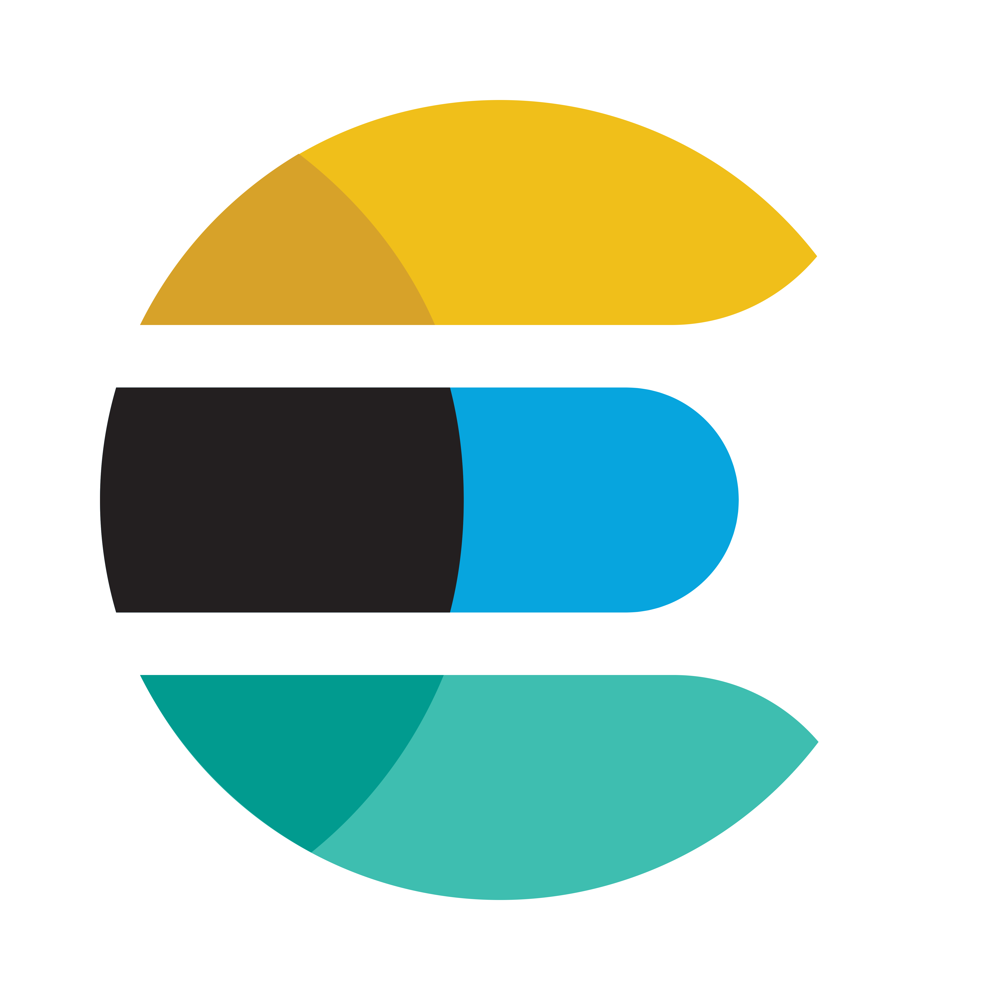
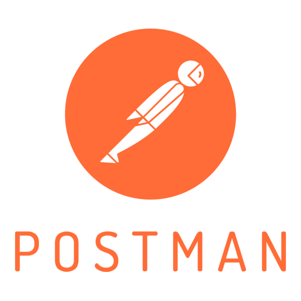

<!-- GIF SECTION -->

<!-- Social icons section -->

    <h2> 🤝🏻 Let's connect with me. </h2>
    
    
    

<!-- Description about me -->
<h2 align="center"> 💫 About me </h2>

    Mahasiswa Semester 6 Jurusan Informatika Universitas Mercu Buana Yogyakarta dengan IPK 3,77. Menguasai pengembangan full-stack menggunakan ekosistem .NET, termasuk ASP.NET Core, MVC dan Entity Framework Core, serta berpengalaman dalam membangun RESTful API yang terstruktur dan scalable dengan penerapan Clean Architecture dan Dependency Injection.

    Memiliki pemahaman yang baik dalam pengelolaan database relasional seperti MySQL dan SQL Server, serta terbiasa menerapkan praktik pengembangan yang berorientasi pada performa dan maintainability.

    Memiliki keinginan besar untuk berkembang dan terus belajar. serta memiliki tujuan untuk memberikan kontribusi nyata dalam pengembangan sistem yang andal dan berkelanjutan.

 

<!-- languajes and skills section -->
<h2 align="center"> 💻 Tech Stack: </h2>

  <code></code>
  <code></code> 
  <code></code> 
  <code></code> 
  <code></code> 
  <code></code> 
  <code></code> 
  <code></code> 
  <code></code> 
  <code></code> 
  <code></code> 
  <code></code> 
  <code></code> 
  <code></code> 
  <code></code> 
  <code></code> 
  <code></code> 
  <code></code> 
  <code></code> 
  <code></code> 
  <code></code> 
  <code></code> 
  <code></code> 
  <code></code> 
  <code></code> 
  <code></code> 

 

<!-- GitHub stats section -->
<h2 align="center"> 📊 Github stats </h2>

    

 

 

<!-- last refresh of readme section -->

Last refresh: <b>Monday, 18 February 2026 at 8:09 AM GMT+7</b>

<!---
DavidsDvm/DavidsDvm is a ✨ special ✨ repository because its `README.md` (this file) appears on your GitHub profile.
You can click the Preview link to take a look at your changes.
--->
